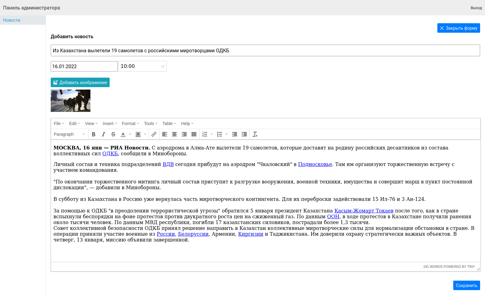

# TestJob

## Build Setup

```bash
# install dependencies
$ yarn install

# serve with hot reload at localhost:3000
$ yarn dev

# build for production and launch server
$ yarn build
$ yarn start

# generate static project
$ yarn generate
```
Задача: разработать личный кабинет администратора новостного портала и ленту новостей.

Функционал:
    1. Публичная часть:
    • Лента новостей.

    2. Административная часть:
    • Вход в кабинет. Формы регистрации и входа;
    • Список новостей;
    • Создание, редактирование, удаление новостей (новость должна содержать текст и изображение);
    • Отложенная публикация новости в общей ленте по времени.
    
    

